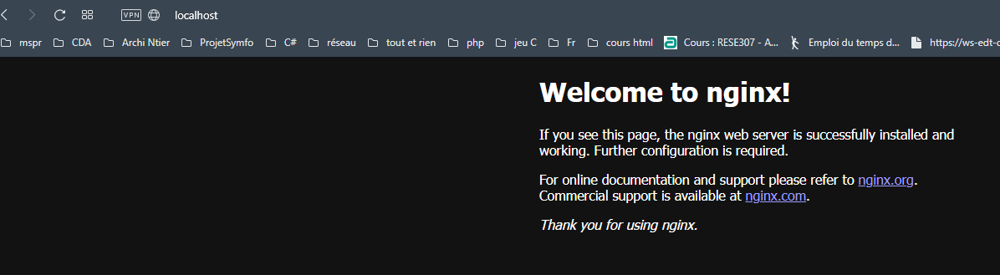
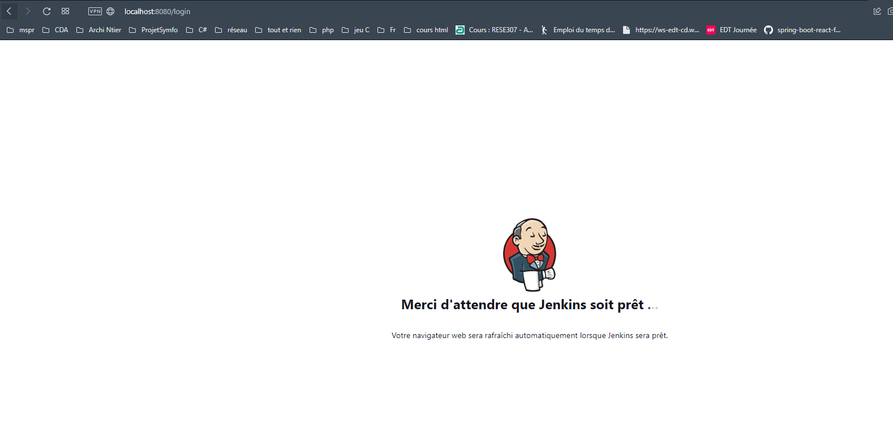

# TP cours DevOps
Eline Malherbe B3 classe2
***
# Mise en place du container nginx

Pour cela j'ai créé un Dockerfile.
Ensuite depuis mon wsl je me suis placée dans le dossier contenant mon Dockerfile et j'ai lancé la commande :
> docker build -t nginx .

(nginx étant le nom que je souhaitais donner à mon image)

Après j'ai lancé la commande suivante pour executer un container depuis mon image : 
> docker run -d -p 80:80 nginx

Et voici le résultat, j'ai accès à mon container

***
# Mise en place du container Jenkins

Même chose que pour nginx, j'ai créé un Dockerfile.
Ensuite depuis mon wsl je me suis placée dans le dossier contenant mon Dockerfile et j'ai lancé la commande :
> docker build -t jenkins .

Après j'ai lancé la commande suivante pour executer un container depuis mon image :
> docker run -d -p 8080:8080 -p 50000:50000 --name jenkins jenkins

Et voici le résultat 

***

